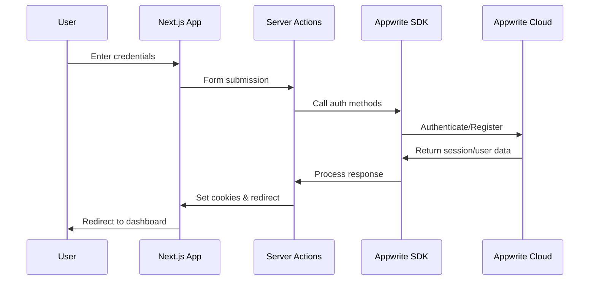
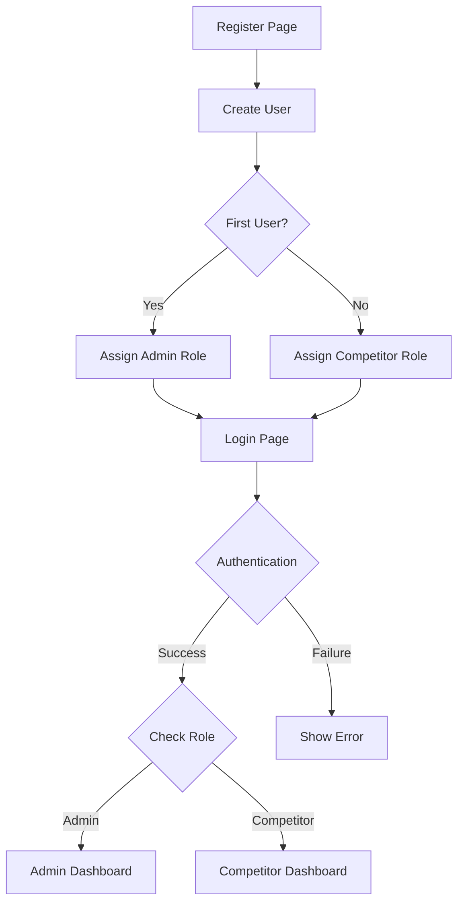
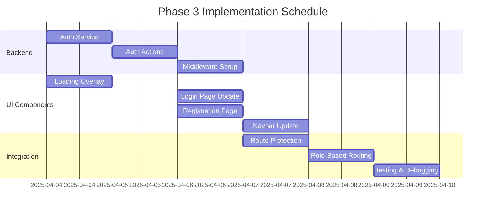

# Phase 3 Implementation Plan: Authentication and User Management

This document outlines the implementation plan for Phase 3 of the Music Manager project, focusing on Authentication and User Management using Appwrite's server-side SDK.

## Table of Contents

1. [Current State Assessment](#current-state-assessment)
2. [Implementation Goals](#implementation-goals)
3. [Technical Architecture](#technical-architecture)
4. [Component Breakdown](#component-breakdown)
5. [Implementation Schedule](#implementation-schedule)
6. [Testing Strategy](#testing-strategy)
7. [Security Considerations](#security-considerations)

## Current State Assessment

Based on a review of the existing codebase, the Music Manager project currently has:

- A basic UI structure with login/register page templates
- Appwrite server connection setup in `src/lib/appwrite/server.ts`
- Helper functions for various operations
- Mock functionality for auth-related components
- Navbar component with placeholder user menu
- Role-based UI preparation in the navbar (different colors based on role)

## Implementation Goals

1. Implement server-side authentication using Appwrite's Node.js SDK
2. Create role-based routing with separate dashboards for Admins and Competitors
3. Develop a user registration system with proper role assignment
4. Implement secure session management
5. Add user feedback through loading indicators and toast notifications
6. Update the navbar to reflect authentication state and user role

## Technical Architecture

### Authentication Flow



### Role-Based Routing



## Component Breakdown

### 1. Server-Side Authentication

#### 1.1 Authentication Service

Create a centralized authentication service module to handle all auth-related functionality:

```typescript
// src/lib/auth/auth-service.ts
import { users, client, ID } from '../appwrite/server'
import { cookies } from 'next/headers'

// Session management
export async function createSession(email: string, password: string) {
  try {
    const session = await users.createEmailSession(email, password)

    // Set session cookie
    cookies().set('mm-session', session.secret, {
      httpOnly: true,
      secure: process.env.NODE_ENV === 'production',
      path: '/',
      maxAge: 60 * 60 * 24 * 7, // 1 week
    })

    return session
  } catch (error) {
    console.error('Login error:', error)
    throw error
  }
}

// Get current session
export async function getCurrentUser() {
  try {
    const sessionCookie = cookies().get('mm-session')

    if (!sessionCookie?.value) {
      return null
    }

    // Use the session to get the current user
    client.setSession(sessionCookie.value)
    return await users.get('current')
  } catch (error) {
    console.error('Error getting current user:', error)
    return null
  }
}

// Register new user
export async function registerUser(
  email: string,
  password: string,
  firstName: string,
  lastName: string
) {
  try {
    // Create the user
    const user = await users.create(
      ID.unique(),
      email,
      password,
      `${firstName} ${lastName}`
    )

    // Set user preferences for first name and last name
    await users.updatePrefs(user.$id, {
      firstName,
      lastName,
    })

    // Check if this is the first user (to assign admin role)
    const usersList = await users.list()
    const isFirstUser = usersList.total === 1

    // Assign role as label
    const role = isFirstUser ? 'admin' : 'competitor'
    await users.updateLabels(user.$id, [role])

    return user
  } catch (error) {
    console.error('Registration error:', error)
    throw error
  }
}

// Logout
export async function logout() {
  try {
    // Delete the session
    const sessionCookie = cookies().get('mm-session')

    if (sessionCookie?.value) {
      client.setSession(sessionCookie.value)
      await users.deleteSession('current')
    }

    // Remove the cookie
    cookies().delete('mm-session')
  } catch (error) {
    console.error('Logout error:', error)
    throw error
  }
}

// Get user role
export async function getUserRole(userId: string) {
  try {
    const user = await users.get(userId)
    return user.labels.includes('admin') ? 'admin' : 'competitor'
  } catch (error) {
    console.error('Error getting user role:', error)
    return null
  }
}
```

#### 1.2 Authentication Middleware

Create a middleware to protect routes and implement role-based access:

```typescript
// src/middleware.ts
import { NextResponse } from 'next/server'
import type { NextRequest } from 'next/server'
import { getCurrentUser, getUserRole } from './lib/auth/auth-service'

export async function middleware(request: NextRequest) {
  const user = await getCurrentUser()
  const pathname = request.nextUrl.pathname

  // Public routes that don't require authentication
  const publicRoutes = ['/', '/login', '/register']
  if (publicRoutes.includes(pathname)) {
    // If user is logged in and tries to access login/register, redirect to dashboard
    if (user && (pathname === '/login' || pathname === '/register')) {
      const role = await getUserRole(user.$id)
      const redirectPath = role === 'admin' ? '/admin/dashboard' : '/dashboard'
      return NextResponse.redirect(new URL(redirectPath, request.url))
    }
    return NextResponse.next()
  }

  // Protected routes that require authentication
  if (!user) {
    return NextResponse.redirect(new URL('/login', request.url))
  }

  // Role-based routing
  const role = await getUserRole(user.$id)

  // Admin-only routes
  if (pathname.startsWith('/admin') && role !== 'admin') {
    return NextResponse.redirect(new URL('/dashboard', request.url))
  }

  return NextResponse.next()
}

export const config = {
  matcher: [
    '/((?!_next/static|_next/image|favicon.ico|api/|images/|fonts/).*)',
  ],
}
```

### 2. User Interface & Form Handling

#### 2.1 Server Actions for Authentication

Create server actions for login, register, and logout operations:

```typescript
// src/app/actions/auth-actions.ts
'use server'

import {
  createSession,
  registerUser,
  logout,
  getCurrentUser,
} from '@/lib/auth/auth-service'
import { redirect } from 'next/navigation'

export async function loginAction(formData: FormData) {
  try {
    const email = formData.get('email') as string
    const password = formData.get('password') as string

    if (!email || !password) {
      return {
        error: 'Email and password are required',
        success: false,
      }
    }

    await createSession(email, password)

    // Get user info to determine redirect
    const user = await getCurrentUser()
    if (!user) {
      return {
        error: 'Login successful but session retrieval failed',
        success: false,
      }
    }

    const role = user.labels.includes('admin') ? 'admin' : 'competitor'
    const redirectPath = role === 'admin' ? '/admin/dashboard' : '/dashboard'

    return {
      success: true,
      redirectTo: redirectPath,
    }
  } catch (error) {
    console.error('Login action error:', error)
    return {
      error: 'Invalid email or password',
      success: false,
    }
  }
}

export async function registerAction(formData: FormData) {
  try {
    const email = formData.get('email') as string
    const password = formData.get('password') as string
    const firstName = formData.get('firstName') as string
    const lastName = formData.get('lastName') as string

    if (!email || !password || !firstName || !lastName) {
      return {
        error: 'All fields are required',
        success: false,
      }
    }

    const user = await registerUser(email, password, firstName, lastName)

    // Create session after registration
    await createSession(email, password)

    const role = user.labels.includes('admin') ? 'admin' : 'competitor'
    const redirectPath = role === 'admin' ? '/admin/dashboard' : '/dashboard'

    return {
      success: true,
      redirectTo: redirectPath,
    }
  } catch (error) {
    console.error('Registration action error:', error)
    return {
      error: 'Registration failed. Email may already be in use.',
      success: false,
    }
  }
}

export async function logoutAction() {
  try {
    await logout()
    redirect('/login')
  } catch (error) {
    console.error('Logout action error:', error)
    return {
      error: 'Logout failed',
      success: false,
    }
  }
}
```

#### 2.2 Login Page Implementation

Update the existing login page to use the server actions:

```typescript
// src/app/(auth)/login/page.tsx
'use client'

import { useState } from 'react'
import Link from 'next/link'
import Image from 'next/image'
import { Button } from '@/components/ui/button'
import { Input } from '@/components/ui/input'
import { toast } from 'sonner'
import { useRouter } from 'next/navigation'
import { loginAction } from '@/app/actions/auth-actions'

export default function LoginPage() {
  const [isLoading, setIsLoading] = useState(false)
  const router = useRouter()

  const handleLogin = async (formData: FormData) => {
    setIsLoading(true)

    try {
      const result = await loginAction(formData)

      if (result.success) {
        toast.success('Logged in successfully')
        router.push(result.redirectTo)
      } else {
        toast.error(result.error || 'Login failed')
      }
    } catch (error) {
      console.error('Login error:', error)
      toast.error('An unexpected error occurred')
    } finally {
      setIsLoading(false)
    }
  }

  return (
    <div className="flex flex-col items-center justify-center py-10 px-4 bg-gradient-to-b from-blue-500/10 to-purple-500/10 min-h-screen w-full absolute inset-0">
      <div className="w-full max-w-md">
        <div className="flex justify-center mb-10 animate-fade-in">
          <Link
            href="/"
            className="flex items-center gap-3 transition-transform hover:scale-105"
          >
            <Image
              src="/mm-logo.png"
              alt="Music Manager Logo"
              width={56}
              height={56}
              className="rounded-lg shadow-sm"
            />
            <h1 className="text-3xl font-bold bg-gradient-to-r from-blue-600 to-indigo-600 bg-clip-text text-transparent">
              Music Manager
            </h1>
          </Link>
        </div>

        <div className="bg-white/80 backdrop-blur-sm rounded-xl shadow-lg border border-blue-100 p-8 transition-all hover:shadow-xl">
          <h2 className="text-2xl font-semibold mb-6 text-center bg-gradient-to-r from-blue-600 to-indigo-600 bg-clip-text text-transparent">
            Welcome Back!
          </h2>

          {isLoading && (
            <div className="fixed inset-0 bg-black/30 backdrop-blur-sm flex items-center justify-center z-50">
              <div className="bg-white p-6 rounded-lg shadow-xl flex flex-col items-center">
                <div className="w-12 h-12 border-4 border-t-blue-600 border-b-blue-600 border-l-transparent border-r-transparent rounded-full animate-spin"></div>
                <p className="mt-4 text-gray-700 font-medium">Logging in...</p>
              </div>
            </div>
          )}

          <form action={handleLogin} className="space-y-5">
            <div className="space-y-2">
              <label
                htmlFor="email"
                className="text-sm font-medium flex items-center gap-2 text-gray-700"
              >
                <svg
                  xmlns="http://www.w3.org/2000/svg"
                  width="16"
                  height="16"
                  viewBox="0 0 24 24"
                  fill="none"
                  stroke="currentColor"
                  strokeWidth="2"
                  strokeLinecap="round"
                  strokeLinejoin="round"
                  className="text-blue-500"
                >
                  <rect width="20" height="16" x="2" y="4" rx="2" />
                  <path d="m22 7-8.97 5.7a1.94 1.94 0 0 1-2.06 0L2 7" />
                </svg>
                <span>Email</span>
              </label>
              <Input
                id="email"
                name="email"
                type="email"
                required
                className="rounded-md border-blue-200 focus-visible:ring-blue-400 transition-all bg-white/90"
                placeholder="your.email@example.com"
              />
            </div>

            <div className="space-y-2">
              <label
                htmlFor="password"
                className="text-sm font-medium flex items-center gap-2 text-gray-700"
              >
                <svg
                  xmlns="http://www.w3.org/2000/svg"
                  width="16"
                  height="16"
                  viewBox="0 0 24 24"
                  fill="none"
                  stroke="currentColor"
                  strokeWidth="2"
                  strokeLinecap="round"
                  strokeLinejoin="round"
                  className="text-blue-500"
                >
                  <rect width="18" height="11" x="3" y="11" rx="2" ry="2" />
                  <path d="M7 11V7a5 5 0 0 1 10 0v4" />
                </svg>
                <span>Password</span>
              </label>
              <Input
                id="password"
                name="password"
                type="password"
                required
                className="rounded-md border-blue-200 focus-visible:ring-blue-400 transition-all bg-white/90"
                placeholder="••••••••"
              />
            </div>

            <div className="pt-2">
              <Button
                type="submit"
                disabled={isLoading}
                className="w-full rounded-md shadow-sm hover:shadow-md transition-all bg-gradient-to-r from-blue-600 to-indigo-600 hover:from-blue-700 hover:to-indigo-700 text-white font-medium py-5"
              >
                {isLoading ? 'Logging in...' : 'Login'}
              </Button>
            </div>
          </form>

          <div className="text-center mt-6 bg-blue-50 p-4 rounded-lg border border-blue-100">
            <p className="text-gray-600 mb-2">Don&apos;t have an account?</p>
            <Link
              href="/register"
              className="inline-flex items-center justify-center px-4 py-2 bg-purple-100 text-purple-700 rounded-full font-medium hover:bg-purple-200 transition-colors text-sm"
            >
              <span>Register Now</span>
              <svg
                xmlns="http://www.w3.org/2000/svg"
                width="16"
                height="16"
                viewBox="0 0 24 24"
                fill="none"
                stroke="currentColor"
                strokeWidth="2"
                strokeLinecap="round"
                strokeLinejoin="round"
                className="ml-1"
              >
                <path d="M12 5v14M5 12h14" />
              </svg>
            </Link>
          </div>
        </div>
      </div>
    </div>
  )
}
```

#### 2.3 Registration Page Implementation

Create a registration page with form validation:

```typescript
// src/app/(auth)/register/page.tsx
'use client'

import { useState } from 'react'
import Link from 'next/link'
import Image from 'next/image'
import { Button } from '@/components/ui/button'
import { Input } from '@/components/ui/input'
import { toast } from 'sonner'
import { useRouter } from 'next/navigation'
import { registerAction } from '@/app/actions/auth-actions'

export default function RegisterPage() {
  const [isLoading, setIsLoading] = useState(false)
  const router = useRouter()

  const handleRegister = async (formData: FormData) => {
    setIsLoading(true)

    try {
      const result = await registerAction(formData)

      if (result.success) {
        toast.success('Registration successful!')
        router.push(result.redirectTo)
      } else {
        toast.error(result.error || 'Registration failed')
      }
    } catch (error) {
      console.error('Registration error:', error)
      toast.error('An unexpected error occurred')
    } finally {
      setIsLoading(false)
    }
  }

  return (
    <div className="flex flex-col items-center justify-center py-10 px-4 bg-gradient-to-b from-blue-500/10 to-purple-500/10 min-h-screen w-full absolute inset-0">
      <div className="w-full max-w-md">
        <div className="flex justify-center mb-10 animate-fade-in">
          <Link
            href="/"
            className="flex items-center gap-3 transition-transform hover:scale-105"
          >
            <Image
              src="/mm-logo.png"
              alt="Music Manager Logo"
              width={56}
              height={56}
              className="rounded-lg shadow-sm"
            />
            <h1 className="text-3xl font-bold bg-gradient-to-r from-blue-600 to-indigo-600 bg-clip-text text-transparent">
              Music Manager
            </h1>
          </Link>
        </div>

        <div className="bg-white/80 backdrop-blur-sm rounded-xl shadow-lg border border-blue-100 p-8 transition-all hover:shadow-xl">
          <h2 className="text-2xl font-semibold mb-6 text-center bg-gradient-to-r from-blue-600 to-indigo-600 bg-clip-text text-transparent">
            Create an Account
          </h2>

          {isLoading && (
            <div className="fixed inset-0 bg-black/30 backdrop-blur-sm flex items-center justify-center z-50">
              <div className="bg-white p-6 rounded-lg shadow-xl flex flex-col items-center">
                <div className="w-12 h-12 border-4 border-t-blue-600 border-b-blue-600 border-l-transparent border-r-transparent rounded-full animate-spin"></div>
                <p className="mt-4 text-gray-700 font-medium">
                  Creating your account...
                </p>
              </div>
            </div>
          )}

          <form action={handleRegister} className="space-y-4">
            <div className="grid grid-cols-2 gap-4">
              <div className="space-y-2">
                <label
                  htmlFor="firstName"
                  className="text-sm font-medium text-gray-700"
                >
                  First Name
                </label>
                <Input
                  id="firstName"
                  name="firstName"
                  type="text"
                  required
                  className="rounded-md border-blue-200 focus-visible:ring-blue-400"
                />
              </div>

              <div className="space-y-2">
                <label
                  htmlFor="lastName"
                  className="text-sm font-medium text-gray-700"
                >
                  Last Name
                </label>
                <Input
                  id="lastName"
                  name="lastName"
                  type="text"
                  required
                  className="rounded-md border-blue-200 focus-visible:ring-blue-400"
                />
              </div>
            </div>

            <div className="space-y-2">
              <label
                htmlFor="email"
                className="text-sm font-medium text-gray-700"
              >
                Email
              </label>
              <Input
                id="email"
                name="email"
                type="email"
                required
                className="rounded-md border-blue-200 focus-visible:ring-blue-400"
                placeholder="your.email@example.com"
              />
            </div>

            <div className="space-y-2">
              <label
                htmlFor="password"
                className="text-sm font-medium text-gray-700"
              >
                Password
              </label>
              <Input
                id="password"
                name="password"
                type="password"
                required
                minLength={8}
                className="rounded-md border-blue-200 focus-visible:ring-blue-400"
                placeholder="••••••••"
              />
              <p className="text-xs text-gray-500">
                Password must be at least 8 characters
              </p>
            </div>

            <Button
              type="submit"
              disabled={isLoading}
              className="w-full mt-4 rounded-md shadow-sm hover:shadow-md transition-all bg-gradient-to-r from-blue-600 to-indigo-600 hover:from-blue-700 hover:to-indigo-700 text-white font-medium py-5"
            >
              {isLoading ? 'Creating Account...' : 'Register'}
            </Button>
          </form>

          <div className="text-center mt-6 bg-blue-50 p-4 rounded-lg border border-blue-100">
            <p className="text-gray-600 mb-2">Already have an account?</p>
            <Link
              href="/login"
              className="inline-flex items-center justify-center px-4 py-2 bg-purple-100 text-purple-700 rounded-full font-medium hover:bg-purple-200 transition-colors text-sm"
            >
              <span>Login</span>
              <svg
                xmlns="http://www.w3.org/2000/svg"
                width="16"
                height="16"
                viewBox="0 0 24 24"
                fill="none"
                stroke="currentColor"
                strokeWidth="2"
                strokeLinecap="round"
                strokeLinejoin="round"
                className="ml-1"
              >
                <path d="m9 18 6-6-6-6" />
              </svg>
            </Link>
          </div>
        </div>
      </div>
    </div>
  )
}
```

### 3. UI Components and Layout Updates

#### 3.1 Loading Overlay Component

Create a reusable loading overlay for async operations:

```typescript
// src/components/ui/loading-overlay.tsx
export default function LoadingOverlay({
  message = 'Loading...',
}: {
  message?: string
}) {
  return (
    <div className="fixed inset-0 bg-black/30 backdrop-blur-sm flex items-center justify-center z-50">
      <div className="bg-white p-6 rounded-lg shadow-xl flex flex-col items-center">
        <div className="w-12 h-12 border-4 border-t-blue-600 border-b-blue-600 border-l-transparent border-r-transparent rounded-full animate-spin"></div>
        <p className="mt-4 text-gray-700 font-medium">{message}</p>
      </div>
    </div>
  )
}
```

#### 3.2 Updated Navbar Component

Update the navbar to use authentication state and display user information:

```typescript
// src/components/layout/navbar.tsx
'use client'

import Link from 'next/link'
import Image from 'next/image'
import { FaUser, FaSignOutAlt, FaMusic } from 'react-icons/fa'
import { useState } from 'react'
import { toast } from 'sonner'
import { useRouter } from 'next/navigation'
import { logoutAction } from '@/app/actions/auth-actions'

type NavbarProps = {
  user?: {
    $id: string
    name: string
    email: string
    labels: string[]
  } | null
}

export default function Navbar({ user }: NavbarProps) {
  const [isUserMenuOpen, setIsUserMenuOpen] = useState(false)
  const [isLoggingOut, setIsLoggingOut] = useState(false)
  const router = useRouter()

  const userRole = user?.labels?.includes('admin') ? 'admin' : 'competitor'

  const toggleUserMenu = () => {
    setIsUserMenuOpen(!isUserMenuOpen)
  }

  const handleLogout = async () => {
    setIsLoggingOut(true)
    try {
      await logoutAction()
      toast.success('Logged out successfully')
      router.push('/login')
    } catch (error) {
      console.error('Logout error:', error)
      toast.error('Logout failed')
    } finally {
      setIsLoggingOut(false)
    }
  }

  // Determine button color based on role
  const buttonColorClass =
    userRole === 'admin'
      ? 'text-purple-600 hover:bg-purple-50'
      : userRole === 'competitor'
      ? 'text-green-600 hover:bg-green-50'
      : 'text-blue-600 hover:bg-blue-50'

  return (
    <nav className="w-full py-4 px-6 bg-gradient-to-r from-blue-50 to-purple-50 border-b border-blue-100 sticky top-0 z-50 shadow-sm backdrop-blur-md">
      <div className="container mx-auto flex justify-between items-center">
        <Link
          href="/"
          className="flex items-center gap-3 transition-transform hover:scale-105"
        >
          <div className="relative">
            <div className="absolute -inset-1 bg-gradient-to-r from-blue-600 to-purple-600 rounded-lg blur opacity-30 group-hover:opacity-100 transition duration-1000 group-hover:duration-200"></div>
            <Image
              src="/mm-logo.png"
              alt="Music Manager Logo"
              width={36}
              height={36}
              className="rounded-md relative"
            />
          </div>
          <h1 className="text-xl font-bold bg-gradient-to-r from-blue-600 to-purple-600 bg-clip-text text-transparent">
            Music Manager
          </h1>
        </Link>

        <div className="flex items-center gap-4">
          {user && (
            <Link
              href={userRole === 'admin' ? '/admin/dashboard' : '/dashboard'}
              className="hidden md:flex items-center gap-2 px-3 py-1.5 text-sm font-medium text-gray-700 hover:text-blue-600 transition-colors"
            >
              <FaMusic className="w-4 h-4" />
              <span>My Music</span>
            </Link>
          )}

          <div className="relative">
            <button
              onClick={toggleUserMenu}
              className={`p-2.5 rounded-full bg-white transition-colors duration-200 flex items-center justify-center border border-blue-100 shadow-sm hover:shadow-md ${buttonColorClass}`}
              aria-label={user ? 'User menu' : 'Login'}
            >
              {isLoggingOut ? (
                <div className="w-5 h-5 border-2 border-t-current border-r-transparent border-b-current border-l-transparent rounded-full animate-spin"></div>
              ) : (
                <FaUser className="w-5 h-5" />
              )}
            </button>

            {isUserMenuOpen && (
              <div className="absolute right-0 mt-2 w-48 bg-white rounded-lg shadow-lg border border-blue-100 py-2 z-50">
                {user ? (
                  <>
                    <div className="px-4 py-2 border-b border-blue-50">
                      <p className="text-sm font-medium text-gray-700">
                        {user.name}
                      </p>
                      <p className="text-xs text-gray-500 truncate">
                        {user.email}
                      </p>
                      <p className="text-xs font-medium mt-1 capitalize">
                        {userRole === 'admin' ? (
                          <span className="text-purple-600">Admin</span>
                        ) : (
                          <span className="text-green-600">Competitor</span>
                        )}
                      </p>
                    </div>
                    <button
                      onClick={handleLogout}
                      disabled={isLoggingOut}
                      className="flex w-full items-center gap-2 px-4 py-2 text-sm text-red-600 hover:bg-red-50 transition-colors"
                    >
                      <FaSignOutAlt className="w-4 h-4" />
                      <span>Logout</span>
                    </button>
                  </>
                ) : (
                  <>
                    <Link
                      href="/login"
                      className="flex items-center gap-2 px-4 py-2 text-sm text-blue-600 hover:bg-blue-50 transition-colors"
                    >
                      <FaUser className="w-4 h-4" />
                      <span>Login</span>
                    </Link>
                    <Link
                      href="/register"
                      className="flex items-center gap-2 px-4 py-2 text-sm text-green-600 hover:bg-green-50 transition-colors"
                    >
                      <FaUser className="w-4 h-4" />
                      <span>Register</span>
                    </Link>
                  </>
                )}
              </div>
            )}
          </div>
        </div>
      </div>
    </nav>
  )
}
```

#### 3.3 Root Layout With Authentication and Toasts

Update the root layout to include Sonner for toast notifications:

```typescript
// src/app/layout.tsx
import './globals.css'
import { Toaster } from 'sonner'
import Navbar from '@/components/layout/navbar'
import { getCurrentUser } from '@/lib/auth/auth-service'

export default async function RootLayout({
  children,
}: {
  children: React.ReactNode
}) {
  const user = await getCurrentUser()

  return (
    <html lang="en">
      <body>
        <Navbar user={user} />
        {children}
        <Toaster position="bottom-right" />
      </body>
    </html>
  )
}
```

#### 3.4 Dashboard Layouts

Implement role-based dashboard layouts:

```typescript
// src/app/dashboard/layout.tsx
import { getCurrentUser, getUserRole } from '@/lib/auth/auth-service'
import { redirect } from 'next/navigation'

export default async function DashboardLayout({
  children,
}: {
  children: React.ReactNode
}) {
  const user = await getCurrentUser()

  if (!user) {
    redirect('/login')
  }

  const role = await getUserRole(user.$id)

  // If user is admin, redirect to admin dashboard
  if (role === 'admin') {
    redirect('/admin/dashboard')
  }

  return <div className="container mx-auto px-4 py-8">{children}</div>
}
```

```typescript
// src/app/admin/dashboard/layout.tsx
import { getCurrentUser, getUserRole } from '@/lib/auth/auth-service'
import { redirect } from 'next/navigation'

export default async function AdminDashboardLayout({
  children,
}: {
  children: React.ReactNode
}) {
  const user = await getCurrentUser()

  if (!user) {
    redirect('/login')
  }

  const role = await getUserRole(user.$id)

  // If user is not admin, redirect to competitor dashboard
  if (role !== 'admin') {
    redirect('/dashboard')
  }

  return <div className="container mx-auto px-4 py-8">{children}</div>
}
```

## Implementation Schedule



## Testing Strategy

1. **Unit Tests:**

   - Test authentication-related functions in isolation
   - Verify proper role assignment logic
   - Test form validation and error handling

2. **Integration Tests:**

   - Test authentication flow end-to-end
   - Verify proper session creation and management
   - Test role-based routing and access control

3. **Manual Testing Scenarios:**

   | Test Case                    | Steps                                          | Expected Result                                                    |
   | ---------------------------- | ---------------------------------------------- | ------------------------------------------------------------------ |
   | First User Registration      | Register as first user in system               | User gets admin role, redirected to admin dashboard                |
   | Subsequent User Registration | Register as second user                        | User gets competitor role, redirected to competitor dashboard      |
   | Login as Admin               | Login with admin credentials                   | Redirected to admin dashboard, navbar shows admin status           |
   | Login as Competitor          | Login with competitor credentials              | Redirected to competitor dashboard, navbar shows competitor status |
   | Route Protection             | Try accessing protected route while logged out | Redirected to login page                                           |
   | Role-Based Access            | Try accessing admin routes as competitor       | Redirected to competitor dashboard                                 |
   | Logout                       | Click logout button                            | Session terminated, redirected to login page                       |
   | Error Handling               | Enter invalid credentials                      | Error toast shown, user remains on login page                      |

## Security Considerations

1. **Session Management:**

   - Use HTTP-only cookies for storing session tokens
   - Set secure flag in production environments
   - Implement proper session expiration

2. **API Security:**

   - Use Appwrite's server-side SDK exclusively for authentication operations
   - Avoid exposing sensitive operations to client-side code
   - Implement proper error handling to prevent information leakage

3. **Role-Based Access Control:**

   - Implement robust server-side checks for user roles
   - Double-check authorization in both middleware and route handlers
   - Prevent privilege escalation through direct URL access

4. **Input Validation:**
   - Validate all form inputs server-side
   - Implement proper error handling for invalid inputs
   - Use parameterized queries to prevent injection attacks
