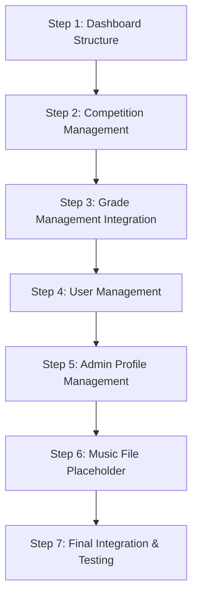

# Music Manager Project: Phase 4 Implementation Plan

# Admin Dashboard Development

## Table of Contents

1. [Overview](#overview)
2. [Step 1: Dashboard Structure](#step-1-dashboard-structure)
3. [Step 2: Competition Management](#step-2-competition-management)
4. [Step 3: Grade Management](#step-3-grade-management)
5. [Step 4: User Management](#step-4-user-management)
6. [Step 5: Admin Profile Management](#step-5-admin-profile-management)
7. [Step 6: Music File Management Placeholder](#step-6-music-file-management-placeholder)
8. [Step 7: Integration and Testing](#step-7-integration-and-testing)

## Overview

This document outlines the detailed implementation plan for Phase 4 of the Music Manager project: Admin Dashboard Development. The implementation will follow the technology stack defined in the main project plan, utilizing Next.js 15 with Server Actions, Appwrite's server-side Node.js SDK, shadcn/UI components, and sonner for toast notifications.

The Admin Dashboard serves as the control center for administrators to manage competitions, grades, users, and monitor music file submissions. This plan is structured in logically sequential, independently deliverable steps to facilitate staged development.

### Key Technical Considerations

- All admin operations will be implemented using the server-side Appwrite Node.js SDK and Server Actions
- The dashboard will be organized into tabs for different management functions
- Visual approach with cards, interactive elements, and clear hierarchy
- Role-based routing leveraging authentication from Phase 3
- Comprehensive error handling with sonner toast notifications



## Step 1: Dashboard Structure

**Objective:** Create the foundational structure for the Admin Dashboard with tabbed navigation.

**Deliverables:**

- Admin dashboard layout with tabs
- Navigation between management sections
- Consistent visual design

**Technical Implementation:**

1. **Create or Update Admin Dashboard Page:**

```typescript
// src/app/admin/dashboard/page.tsx
import { Tabs, TabsContent, TabsList, TabsTrigger } from '@/components/ui/tabs'
import { Toaster } from 'sonner'

export default async function AdminDashboard() {
  return (
    <>
      <div className="container mx-auto py-6 px-4 sm:px-6 lg:px-8">
        <h1 className="text-3xl font-bold text-primary mb-8">
          Admin Dashboard
        </h1>

        <Tabs defaultValue="competitions" className="w-full">
          <TabsList className="grid w-full grid-cols-4 mb-8">
            <TabsTrigger value="competitions">Competition & Grades</TabsTrigger>
            <TabsTrigger value="users">User Management</TabsTrigger>
            <TabsTrigger value="profile">Admin Profile</TabsTrigger>
            <TabsTrigger value="musicfiles">Music Files</TabsTrigger>
          </TabsList>

          <TabsContent value="competitions" className="mt-6">
            {/* Competition & Grade Management Component */}
            <div className="rounded-lg border p-8 text-center">
              Competition and Grade Management Coming Soon
            </div>
          </TabsContent>

          <TabsContent value="users" className="mt-6">
            {/* User Management Component */}
            <div className="rounded-lg border p-8 text-center">
              User Management Coming Soon
            </div>
          </TabsContent>

          <TabsContent value="profile" className="mt-6">
            {/* Admin Profile Component */}
            <div className="rounded-lg border p-8 text-center">
              Admin Profile Management Coming Soon
            </div>
          </TabsContent>

          <TabsContent value="musicfiles" className="mt-6">
            {/* Music File Management Component */}
            <div className="rounded-lg border p-8 text-center">
              Music File Management Coming Soon
            </div>
          </TabsContent>
        </Tabs>
      </div>

      <Toaster position="bottom-right" />
    </>
  )
}
```

2. **Update Dashboard Layout (if needed):**

```typescript
// src/app/admin/dashboard/layout.tsx
import { redirect } from 'next/navigation'
import { getCurrentUser } from '@/app/actions/auth-actions'

export default async function AdminDashboardLayout({
  children,
}: {
  children: React.ReactNode
}) {
  // Verify admin authorization
  const user = await getCurrentUser()

  if (!user || !user.labels.includes('admin')) {
    redirect('/')
  }

  return <div className="min-h-screen bg-background">{children}</div>
}
```

**Context from mm-plan.md:**

- "Dashboard to have separate TABS for Music [File management], [User Management], [Competition and Grade Management] and [Admin User profile management]"
- "All admin operations will be implemented using the server-side Appwrite Node.js SDK and Server Actions"
- "Use modern, colorful, stylish design for forms and tables like the rest of the existing application"

## Step 2: Competition Management

**Objective:** Create a visually engaging interface for viewing, creating, and managing competitions.

**Deliverables:**

- Competition listing with visual cards
- Selection interface with hover effects and highlighting
- Competition creation interface with default/clone options
- Active/inactive toggle functionality

**Technical Implementation:**

1. **Create Competition Management Container Component:**

```typescript
// src/components/dashboard/admin/competition-management.tsx
'use client'

import { useState, useEffect } from 'react'
import { Card, CardContent } from '@/components/ui/card'
import { Button } from '@/components/ui/button'
import { Plus } from 'lucide-react'
import { toast } from 'sonner'
import { getCompetitions } from '@/app/actions/competition-actions'
import CompetitionList from './competition-list'
import CreateCompetitionDialog from './create-competition-dialog'
import GradeManagement from './grade-management'

export default function CompetitionManagement() {
  const [competitions, setCompetitions] = useState([])
  const [selectedCompetition, setSelectedCompetition] = useState(null)
  const [isLoading, setIsLoading] = useState(true)
  const [showCreateDialog, setShowCreateDialog] = useState(false)

  useEffect(() => {
    loadCompetitions()
  }, [])

  const loadCompetitions = async () => {
    setIsLoading(true)
    try {
      const data = await getCompetitions()
      setCompetitions(data)
      if (data.length > 0 && !selectedCompetition) {
        setSelectedCompetition(data[0])
      }
    } catch (error) {
      toast.error(`Failed to load competitions: ${error.message}`)
    } finally {
      setIsLoading(false)
    }
  }

  return (
    <div className="grid grid-cols-1 md:grid-cols-12 gap-6">
      <div className="md:col-span-4">
        <div className="flex justify-between items-center mb-4">
          <h2 className="text-xl font-semibold">Competitions</h2>
          <Button
            onClick={() => setShowCreateDialog(true)}
            className="flex items-center gap-1"
          >
            <Plus className="h-4 w-4" /> Create New
          </Button>
        </div>

        <Card>
          <CardContent className="p-4">
            {isLoading ? (
              <div className="py-8 text-center">Loading competitions...</div>
            ) : competitions.length === 0 ? (
              <div className="py-8 text-center">
                No competitions found. Create your first competition!
              </div>
            ) : (
              <CompetitionList
                competitions={competitions}
                selectedCompetition={selectedCompetition}
                onSelectCompetition={setSelectedCompetition}
              />
            )}
          </CardContent>
        </Card>

        {showCreateDialog && (
          <CreateCompetitionDialog
            competitions={competitions}
            open={showCreateDialog}
            onOpenChange={setShowCreateDialog}
            onSuccess={() => {
              loadCompetitions()
              setShowCreateDialog(false)
            }}
          />
        )}
      </div>

      <div className="md:col-span-8">
        {selectedCompetition ? (
          <GradeManagement
            competition={selectedCompetition}
            onCompetitionUpdate={loadCompetitions}
          />
        ) : (
          <Card>
            <CardContent className="p-6 text-center">
              <p className="text-muted-foreground">
                Select a competition to manage its grades
              </p>
            </CardContent>
          </Card>
        )}
      </div>
    </div>
  )
}
```

2. **Create Competition List Component:**

```typescript
// src/components/dashboard/admin/competition-list.tsx
import { ScrollArea } from '@/components/ui/scroll-area'
import CompetitionCard from './competition-card'

export default function CompetitionList({
  competitions,
  selectedCompetition,
  onSelectCompetition,
}) {
  // Group competitions by year
  const competitionsByYear = competitions.reduce((acc, comp) => {
    const year = comp.year
    if (!acc[year]) {
      acc[year] = []
    }
    acc[year].push(comp)
    return acc
  }, {})

  // Sort years descending
  const sortedYears = Object.keys(competitionsByYear)
    .map(Number)
    .sort((a, b) => b - a)

  // Sort competitions within each year by name ascending
  sortedYears.forEach((year) => {
    competitionsByYear[year].sort((a, b) => a.name.localeCompare(b.name))
  })

  return (
    <ScrollArea className="h-[calc(100vh-280px)]">
      <div className="space-y-5 pr-3">
        {sortedYears.map((year) => (
          <div key={year}>
            <h3 className="font-medium text-sm text-muted-foreground mb-2">
              {year}
            </h3>
            <div className="space-y-2">
              {competitionsByYear[year].map((competition) => (
                <CompetitionCard
                  key={competition.$id}
                  competition={competition}
                  isSelected={selectedCompetition?.$id === competition.$id}
                  onSelect={() => onSelectCompetition(competition)}
                />
              ))}
            </div>
          </div>
        ))}
      </div>
    </ScrollArea>
  )
}
```

3. **Create Competition Card Component:**

```typescript
// src/components/dashboard/admin/competition-card.tsx
import { Card, CardContent } from '@/components/ui/card'
import { Switch } from '@/components/ui/switch'
import { Badge } from '@/components/ui/badge'
import { updateCompetitionStatus } from '@/app/actions/competition-actions'
import { toast } from 'sonner'

export default function CompetitionCard({ competition, isSelected, onSelect }) {
  const handleStatusChange = async (e) => {
    e.stopPropagation()
    try {
      await updateCompetitionStatus(competition.$id, !competition.active)
      toast.success(
        `Competition ${!competition.active ? 'activated' : 'deactivated'}`
      )
    } catch (error) {
      toast.error(`Failed to update status: ${error.message}`)
    }
  }

  return (
    <Card
      className={`
        cursor-pointer 
        transition-all 
        hover:shadow-md 
        ${isSelected ? 'border-primary bg-primary/5' : 'hover:bg-accent/50'}
      `}
      onClick={onSelect}
    >
      <CardContent className="p-3">
        <div className="flex justify-between items-center">
          <div>
            <h3 className="font-medium">{competition.name}</h3>
            <div className="flex items-center mt-1 gap-2">
              <Badge
                variant={competition.active ? 'default' : 'outline'}
                className={
                  competition.active ? 'bg-green-500 hover:bg-green-600' : ''
                }
              >
                {competition.active ? 'Active' : 'Inactive'}
              </Badge>
            </div>
          </div>
          <Switch
            checked={competition.active}
            onCheckedChange={handleStatusChange}
            onClick={(e) => e.stopPropagation()}
            aria-label={`Competition ${
              competition.active ? 'active' : 'inactive'
            }`}
          />
        </div>
      </CardContent>
    </Card>
  )
}
```

4. **Create New Competition Dialog:**

```typescript
// src/components/dashboard/admin/create-competition-dialog.tsx
'use client'

import { useState } from 'react'
import {
  Dialog,
  DialogContent,
  DialogHeader,
  DialogTitle,
} from '@/components/ui/dialog'
import { Button } from '@/components/ui/button'
import { Input } from '@/components/ui/input'
import { Switch } from '@/components/ui/switch'
import { Label } from '@/components/ui/label'
import { RadioGroup, RadioGroupItem } from '@/components/ui/radio-group'
import {
  Select,
  SelectContent,
  SelectItem,
  SelectTrigger,
  SelectValue,
} from '@/components/ui/select'
import { toast } from 'sonner'
import { createCompetition } from '@/app/actions/competition-actions'

export default function CreateCompetitionDialog({
  competitions,
  open,
  onOpenChange,
  onSuccess,
}) {
  const [formData, setFormData] = useState({
    name: '',
    year: new Date().getFullYear(),
    active: true,
    gradeSource: 'default',
    cloneFromCompetitionId: '',
  })

  const [isSubmitting, setIsSubmitting] = useState(false)

  const handleSubmit = async (e) => {
    e.preventDefault()
    setIsSubmitting(true)

    try {
      await createCompetition({
        name: formData.name,
        year: formData.year,
        active: formData.active,
        useDefaultGrades: formData.gradeSource === 'default',
        cloneFromCompetitionId:
          formData.gradeSource === 'clone'
            ? formData.cloneFromCompetitionId
            : undefined,
      })

      toast.success('Competition created successfully')
      onSuccess()
    } catch (error) {
      toast.error(`Failed to create competition: ${error.message}`)
    } finally {
      setIsSubmitting(false)
    }
  }

  return (
    <Dialog open={open} onOpenChange={onOpenChange}>
      <DialogContent className="sm:max-w-[500px]">
        <DialogHeader>
          <DialogTitle>Create New Competition</DialogTitle>
        </DialogHeader>

        <form onSubmit={handleSubmit} className="space-y-4 py-4">
          <div className="grid grid-cols-4 gap-4">
            <div className="col-span-3">
              <Label htmlFor="competition-name">Competition Name</Label>
              <Input
                id="competition-name"
                placeholder="Enter competition name"
                value={formData.name}
                onChange={(e) =>
                  setFormData({ ...formData, name: e.target.value })
                }
                required
              />
            </div>

            <div>
              <Label htmlFor="competition-year">Year</Label>
              <Input
                id="competition-year"
                type="number"
                min={2000}
                max={2100}
                value={formData.year}
                onChange={(e) =>
                  setFormData({ ...formData, year: Number(e.target.value) })
                }
                required
              />
            </div>
          </div>

          <div className="flex items-center justify-between space-x-2">
            <Label htmlFor="competition-active">Active Competition</Label>
            <Switch
              id="competition-active"
              checked={formData.active}
              onCheckedChange={(checked) =>
                setFormData({ ...formData, active: checked })
              }
            />
          </div>

          <div className="space-y-2">
            <Label>Grade Source</Label>
            <RadioGroup
              value={formData.gradeSource}
              onValueChange={(value) =>
                setFormData({ ...formData, gradeSource: value })
              }
              className="space-y-2"
            >
              <div className="flex items-center space-x-2">
                <RadioGroupItem value="default" id="default-grades" />
                <Label htmlFor="default-grades">Use default grades</Label>
              </div>

              <div className="flex items-center space-x-2">
                <RadioGroupItem value="clone" id="clone-grades" />
                <Label htmlFor="clone-grades">
                  Clone from existing competition
                </Label>
              </div>
            </RadioGroup>

            {formData.gradeSource === 'clone' && (
              <div className="pl-6 pt-2">
                <Select
                  value={formData.cloneFromCompetitionId}
                  onValueChange={(value) =>
                    setFormData({ ...formData, cloneFromCompetitionId: value })
                  }
                  required={formData.gradeSource === 'clone'}
                >
                  <SelectTrigger>
                    <SelectValue placeholder="Select a competition" />
                  </SelectTrigger>
                  <SelectContent>
                    {competitions.map((comp) => (
                      <SelectItem key={comp.$id} value={comp.$id}>
                        {comp.name} ({comp.year})
                      </SelectItem>
                    ))}
                  </SelectContent>
                </Select>
              </div>
            )}
          </div>

          <div className="flex justify-end space-x-2 pt-4">
            <Button
              type="button"
              variant="outline"
              onClick={() => onOpenChange(false)}
              disabled={isSubmitting}
            >
              Cancel
            </Button>
            <Button type="submit" disabled={isSubmitting}>
              {isSubmitting ? 'Creating...' : 'Create Competition'}
            </Button>
          </div>
        </form>
      </DialogContent>
    </Dialog>
  )
}
```

5. **Create Competition Server Actions:**

```typescript
// src/app/actions/competition-actions.ts
'use server'

import { databases } from '@/lib/appwrite/server'
import { ID, Query } from 'node-appwrite'
import { defaultGrades } from '@/Docs/default-grades'
import { revalidatePath } from 'next/cache'

const databaseId = process.env.APPWRITE_DATABASE_ID!
const competitionsCollectionId =
  process.env.APPWRITE_COMPETITIONS_COLLECTION_ID!
const gradesCollectionId = process.env.APPWRITE_GRADES_COLLECTION_ID!

export async function getCompetitions() {
  try {
    const response = await databases.listDocuments(
      databaseId,
      competitionsCollectionId,
      [Query.orderDesc('year'), Query.orderAsc('name'), Query.limit(100)]
    )

    return response.documents
  } catch (error) {
    console.error('Error fetching competitions:', error)
    throw new Error('Failed to fetch competitions')
  }
}

export async function createCompetition({
  name,
  year,
  active,
  useDefaultGrades,
  cloneFromCompetitionId,
}: {
  name: string
  year: number
  active: boolean
  useDefaultGrades: boolean
  cloneFromCompetitionId?: string
}) {
  try {
    // Create competition document
    const competition = await databases.createDocument(
      databaseId,
      competitionsCollectionId,
      ID.unique(),
      {
        name,
        year,
        active,
      }
    )

    // Create associated grades
    if (useDefaultGrades) {
      // Use default grades from template
      for (const grade of defaultGrades) {
        await databases.createDocument(
          databaseId,
          gradesCollectionId,
          ID.unique(),
          {
            name: grade.name,
            category: grade.category,
            segment: grade.segment,
            competitionId: competition.$id,
          }
        )
      }
    } else if (cloneFromCompetitionId) {
      // Clone grades from existing competition
      const existingGrades = await databases.listDocuments(
        databaseId,
        gradesCollectionId,
        [Query.equal('competitionId', cloneFromCompetitionId)]
      )

      for (const grade of existingGrades.documents) {
        await databases.createDocument(
          databaseId,
          gradesCollectionId,
          ID.unique(),
          {
            name: grade.name,
            category: grade.category,
            segment: grade.segment,
            competitionId: competition.$id,
          }
        )
      }
    }

    revalidatePath('/admin/dashboard')
    return competition
  } catch (error) {
    console.error('Error creating competition:', error)
    throw new Error('Failed to create competition')
  }
}

export async function updateCompetitionStatus(
  competitionId: string,
  active: boolean
) {
  try {
    const result = await databases.updateDocument(
      databaseId,
      competitionsCollectionId,
      competitionId,
      { active }
    )

    revalidatePath('/admin/dashboard')
    return result
  } catch (error) {
    console.error('Error updating competition status:', error)
    throw new Error('Failed to update competition status')
  }
}

export async function deleteCompetition(competitionId: string) {
  try {
    // Delete all associated grades first
    const grades = await databases.listDocuments(
      databaseId,
      gradesCollectionId,
      [Query.equal('competitionId', competitionId)]
    )

    // Delete grades
    for (const grade of grades.documents) {
      await databases.deleteDocument(databaseId, gradesCollectionId, grade.$id)
    }

    // Delete competition
    await databases.deleteDocument(
      databaseId,
      competitionsCollectionId,
      competitionId
    )

    revalidatePath('/admin/dashboard')
    return true
  } catch (error) {
    console.error('Error deleting competition:', error)
    throw new Error('Failed to delete competition')
  }
}
```

6. **Update Admin Dashboard Tab Content:**

```typescript
// In src/app/admin/dashboard/page.tsx
<TabsContent value="competitions" className="mt-6">
  <CompetitionManagement />
</TabsContent>
```

**Context from mm-plan.md:**

- "Competition Management Structure: Create a comprehensive Competition management interface with CRUD functionality via server-side API routes"
- "Creating a new Competition will create associated default grades"
- "Have the ability when creating a new competition to choose whether to use default grades or clone another existing competition from a drop down list"
- "Have the ability to make a competition active/inactive"
- "Dashboard should display active and inactive competitions separately" (handled via visual indicators)
- User preference from followup: "Competitions should be listed by year (descending) then by Name (ascending)"

## Step 3: Grade Management

**Objective:** Implement a grade management interface that displays and allows modification of grades for the selected competition.

**Deliverables:**

- Grade listing for selected competition
- Grade creation interface
- Grade editing functionality inline, row highlighted when in edit mode.
- Grade deletion with confirmation

**Technical Implementation:**

1. **Create Grade Management Component:**

```typescript
// src/components/dashboard/admin/grade-management.tsx
'use client'

import { useState, useEffect } from 'react'
import { Card, CardContent, CardHeader, CardTitle } from '@/components/ui/card'
import { Button } from '@/components/ui/button'
import {
  Table,
  TableHeader,
  TableBody,
  TableRow,
  TableHead,
  TableCell,
} from '@/components/ui/table'
import {
  Dialog,
  DialogContent,
  DialogHeader,
  DialogTitle,
} from '@/components/ui/dialog'
import {
  AlertDialog,
  AlertDialogAction,
  AlertDialogCancel,
  AlertDialogContent,
  AlertDialogDescription,
  AlertDialogFooter,
  AlertDialogHeader,
  AlertDialogTitle,
  AlertDialogTrigger,
} from '@/components/ui/alert-dialog'
import { Pencil, Plus, Trash } from 'lucide-react'
import { toast } from 'sonner'
import {
  getGradesByCompetition,
  deleteGrade,
} from '@/app/actions/grade-actions'
import GradeForm from './grade-form'

export default function GradeManagement({ competition, onCompetitionUpdate }) {
  const [grades, setGrades] = useState([])
  const [isLoading, setIsLoading] = useState(true)
  const [showCreateDialog, setShowCreateDialog] = useState(false)
  const [editingGrade, setEditingGrade] = useState(null)

  useEffect(() => {
    if (competition) {
      loadGrades()
    }
  }, [competition?.$id])

  const loadGrades = async () => {
    setIsLoading(true)
    try {
      const data = await getGradesByCompetition(competition.$id)
      setGrades(data)
    } catch (error) {
      toast.error(`Failed to load grades: ${error.message}`)
    } finally {
      setIsLoading(false)
    }
  }

  const handleDeleteGrade = async (gradeId) => {
    try {
      await deleteGrade(gradeId)
      toast.success('Grade deleted successfully')
      loadGrades()
    } catch (error) {
      toast.error(`Failed to delete grade: ${error.message}`)
    }
  }

  return (
    <>
      <Card>
        <CardHeader className="flex flex-row items-center justify-between space-y-0 pb-2">
          <div>
            <CardTitle className="text-xl font-semibold">
              {competition.name} - Grades
            </CardTitle>
            <p className="text-sm text-muted-foreground mt-1">
              {competition.active
                ? 'Active Competition'
                : 'Inactive Competition'}{' '}
              ({competition.year})
            </p>
          </div>
          <Button onClick={() => setShowCreateDialog(true)}>
            <Plus className="h-4 w-4 mr-2" /> Add Grade
          </Button>
        </CardHeader>
        <CardContent>
          {isLoading ? (
            <div className="py-8 text-center">Loading grades...</div>
          ) : grades.length === 0 ? (
            <div className="py-8 text-center text-muted-foreground">
              No grades found for this competition
            </div>
          ) : (
            <Table>
              <TableHeader>
                <TableRow>
                  <TableHead>Name</TableHead>
                  <TableHead>Category</TableHead>
                  <TableHead>Segment</TableHead>
                  <TableHead className="text-right">Actions</TableHead>
                </TableRow>
              </TableHeader>
              <TableBody>
                {grades.map((grade) => (
                  <TableRow key={grade.$id}>
                    <TableCell className="font-medium">{grade.name}</TableCell>
                    <TableCell>{grade.category}</TableCell>
                    <TableCell>{grade.segment}</TableCell>
                    <TableCell className="text-right">
                      <div className="flex justify-end space-x-2">
                        <Button
                          variant="ghost"
                          size="icon"
                          onClick={() => setEditingGrade(grade)}
                        >
                          <Pencil className="h-4 w-4" />
                        </Button>

                        <AlertDialog>
                          <AlertDialogTrigger asChild>
                            <Button
                              variant="ghost"
                              size="icon"
                              className="text-destructive"
                            >
                              <Trash className="h-4 w-4" />
                            </Button>
                          </AlertDialogTrigger>
                          <AlertDialogContent>
                            <AlertDialogHeader>
                              <AlertDialogTitle>Delete Grade</AlertDialogTitle>
                              <AlertDialogDescription>
                                Are you sure you want to delete the "
                                {grade.name}" grade? This action cannot be
                                undone.
                              </AlertDialogDescription>
                            </AlertDialogHeader>
                            <AlertDialogFooter>
                              <AlertDialogCancel>Cancel</AlertDialogCancel>
                              <AlertDialogAction
                                className="bg-destructive text-destructive-foreground"
                                onClick={() => handleDeleteGrade(grade.$id)}
                              >
                                Delete
                              </AlertDialogAction>
                            </AlertDialogFooter>
                          </AlertDialogContent>
                        </AlertDialog>
                      </div>
                    </TableCell>
                  </TableRow>
                ))}
              </TableBody>
            </Table>
          )}
        </CardContent>
      </Card>

      {/* Create Grade Dialog */}
      <Dialog open={showCreateDialog} onOpenChange={setShowCreateDialog}>
        <DialogContent>
          <DialogHeader>
            <DialogTitle>Add New Grade</DialogTitle>
          </DialogHeader>
          <GradeForm
            competitionId={competition.$id}
            onSuccess={() => {
              loadGrades()
              setShowCreateDialog(false)
              toast.success('Grade added successfully')
            }}
          />
        </DialogContent>
      </Dialog>

      {/* Edit Grade Dialog */}
      {editingGrade && (
        <Dialog
          open={!!editingGrade}
          onOpenChange={(open) => !open && setEditingGrade(null)}
        >
          <DialogContent>
            <DialogHeader>
              <DialogTitle>Edit Grade</DialogTitle>
            </DialogHeader>
            <GradeForm
              competitionId={competition.$id}
              grade={editingGrade}
              onSuccess={() => {
                loadGrades()
                setEditingGrade(null)
                toast.success('Grade updated successfully')
              }}
            />
          </DialogContent>
        </Dialog>
      )}
    </>
  )
}
```

2. **Create Grade Form Component:**

```typescript
// src/components/dashboard/admin/grade-form.tsx
'use client'

import { useState } from 'react'
import { Button } from '@/components/ui/button'
import { Input } from '@/components/ui/input'
import { Label } from '@/components/ui/label'
import {
  Select,
  SelectContent,
  SelectItem,
  SelectTrigger,
  SelectValue,
} from '@/components/ui/select'
import { createGrade, updateGrade } from '@/app/actions/grade-actions'

const CATEGORIES = ['Junior', 'Senior', 'Intermediate', 'Novice', 'Adult']
const SEGMENTS = ['Solo', 'Pair', 'Group', 'Dance', 'Free']

export default function GradeForm({ competitionId, grade = null, onSuccess }) {
  const [formData, setFormData] = useState({
    name: grade?.name || '',
    category: grade?.category || '',
    segment: grade?.segment || '',
  })

  const [isSubmitting, setIsSubmitting] = useState(false)

  const handleSubmit = async (e) => {
    e.preventDefault()
    setIsSubmitting(true)

    try {
      if (grade) {
        // Update existing grade
        await updateGrade(grade.$id, {
          name: formData.name,
          category: formData.category,
          segment: formData.segment,
        })
      } else {
        // Create new grade
        await createGrade({
          name: formData.name,
          category: formData.category,
          segment: formData.segment,
          competitionId,
        })
      }

      onSuccess()
    } catch (error) {
      console.error('Error saving grade:', error)
    } finally {
      setIsSubmitting(false)
    }
  }

  return (
    <form onSubmit={handleSubmit} className="space-y-4 py-4">
      <div className="space-y-2">
        <Label htmlFor="grade-name">Grade Name</Label>
        <Input
          id="grade-name"
          placeholder="e.g., Preliminary, Elementary, Basic"
          value={formData.name}
          onChange={(e) => setFormData({ ...formData, name: e.target.value })}
          required
        />
      </div>

      <div className="space-y-2">
        <Label htmlFor="grade-category">Category</Label>
        <Select
          value={formData.category}
          onValueChange={(value) =>
            setFormData({ ...formData, category: value })
          }
          required
        >
          <SelectTrigger id="grade-category">
            <SelectValue placeholder="Select category" />
          </SelectTrigger>
          <SelectContent>
            {CATEGORIES.map((category) => (
              <SelectItem key={category} value={category}>
                {category}
              </SelectItem>
            ))}
            <SelectItem value="custom">Custom...</SelectItem>
          </SelectContent>
        </Select>

        {formData.category === 'custom' && (
          <div className="mt-2">
            <Input
              placeholder="Enter custom category"
              value={formData.category === 'custom' ? '' : formData.category}
              onChange={(e) =>
                setFormData({ ...formData, category: e.target.value })
              }
              required
            />
          </div>
        )}
      </div>

      <div className="space-y-2">
        <Label htmlFor="grade-segment">Segment</Label>
        <Select
          value={formData.segment}
          onValueChange={(value) =>
            setFormData({ ...formData, segment: value })
          }
          required
        >
          <SelectTrigger id="grade-segment">
            <SelectValue placeholder="Select segment" />
          </SelectTrigger>
          <SelectContent>
            {SEGMENTS.map((segment) => (
              <SelectItem key={segment} value={segment}>
                {segment}
              </SelectItem>
            ))}
            <SelectItem value="custom">Custom...</SelectItem>
          </SelectContent>
        </Select>

        {formData.segment === 'custom' && (
          <div className="mt-2">
            <Input
              placeholder="Enter custom segment"
              value={formData.segment === 'custom' ? '' : formData.segment}
              onChange={(e) =>
                setFormData({ ...formData, segment: e.target.value })
              }
              required
            />
          </div>
        )}
      </div>

      <div className="flex justify-end space-x-2 pt-4">
        <Button
          type="button"
          variant="outline"
          onClick={() => onSuccess()}
          disabled={isSubmitting}
        >
          Cancel
        </Button>
        <Button type="submit" disabled={isSubmitting}>
          {isSubmitting ? 'Saving...' : grade ? 'Update Grade' : 'Create Grade'}
        </Button>
      </div>
    </form>
  )
}
```

3. **Create Grade Server Actions:**

```typescript
// src/app/actions/grade-actions.ts
'use server'

import { databases } from '@/lib/appwrite/server'
import { ID, Query } from 'node-appwrite'
import { revalidatePath } from 'next/cache'

const databaseId = process.env.APPWRITE_DATABASE_ID!
const gradesCollectionId = process.env.APPWRITE_GRADES_COLLECTION_ID!

export async function getGradesByCompetition(competitionId: string) {
  try {
    const response = await databases.listDocuments(
      databaseId,
      gradesCollectionId,
      [Query.equal('competitionId', competitionId), Query.limit(100)]
    )

    return response.documents
  } catch (error) {
    console.error('Error fetching grades:', error)
    throw new Error('Failed to fetch grades')
  }
}

export async function createGrade({
  name,
  category,
  segment,
  competitionId,
}: {
  name: string
  category: string
  segment: string
  competitionId: string
}) {
  try {
    const result = await databases.createDocument(
      databaseId,
      gradesCollectionId,
      ID.unique(),
      {
        name,
        category,
        segment,
        competitionId,
      }
    )

    revalidatePath('/admin/dashboard')
    return result
  } catch (error) {
    console.error('Error creating grade:', error)
    throw new Error('Failed to create grade')
  }
}

export async function updateGrade(
  gradeId: string,
  data: {
    name?: string
    category?: string
    segment?: string
  }
) {
  try {
    const result = await databases.updateDocument(
      databaseId,
      gradesCollectionId,
      gradeId,
      data
    )

    revalidatePath('/admin/dashboard')
    return result
  } catch (error) {
    console.error('Error updating grade:', error)
    throw new Error('Failed to update grade')
  }
}

export async function deleteGrade(gradeId: string) {
  try {
    await databases.deleteDocument(databaseId, gradesCollectionId, gradeId)

    revalidatePath('/admin/dashboard')
    return true
  } catch (error) {
    console.error('Error deleting grade:', error)
    throw new Error('Failed to delete grade')
  }
}
```

**Context from mm-plan.md:**

- "Grade Management Within Competitions: Enable adding, editing, removing grades for each competition using server-side operations"
- "Support batch operations and cascading deletions"
- "Have inline editing of a Grades details (edit cancel options)"
- "Use sonner for success/failure toasts"
- "Confirm destructive operations with modal dialogs"
- User preference from followup: "Grades should be in a separate interface that is already visible and showing the grades for a Competition"

## Step 4: User Management

**Objective:** Implement a comprehensive user management interface to view, edit, and manage all user accounts.

**Deliverables:**

- User listing with role and status information
- Role management (admin/competitor toggle)
- User account status management
- User deletion with confirmation
- User details like phone and email should be visable.

**Technical Implementation:**

1. **Create User Management Component:**

```typescript
// src/components/dashboard/admin/user-management.tsx
'use client'

import { useState, useEffect } from 'react'
import { Card, CardContent, CardHeader, CardTitle } from '@/components/ui/card'
import {
  Table,
  TableHeader,
  TableBody,
  TableRow,
  TableHead,
  TableCell,
} from '@/components/ui/table'
import { Button } from '@/components/ui/button'
import { Switch } from '@/components/ui/switch'
import { Badge } from '@/components/ui/badge'
import {
  AlertDialog,
  AlertDialogAction,
  AlertDialogCancel,
  AlertDialogContent,
  AlertDialogDescription,
  AlertDialogFooter,
  AlertDialogHeader,
  AlertDialogTitle,
  AlertDialogTrigger,
} from '@/components/ui/alert-dialog'
import { Input } from '@/components/ui/input'
import { Trash, Shield, ShieldAlert, Search } from 'lucide-react'
import { toast } from 'sonner'
import {
  getAllUsers,
  updateUserRole,
  updateUserStatus,
  deleteUser,
} from '@/app/actions/user-actions'

export default function UserManagement() {
  const [users, setUsers] = useState([])
  const [filteredUsers, setFilteredUsers] = useState([])
  const [isLoading, setIsLoading] = useState(true)
  const [searchQuery, setSearchQuery] = useState('')

  useEffect(() => {
    loadUsers()
  }, [])

  useEffect(() => {
    if (searchQuery.trim() === '') {
      setFilteredUsers(users)
    } else {
      const query = searchQuery.toLowerCase()
      setFilteredUsers(
        users.filter(
          (user) =>
            user.name?.toLowerCase().includes(query) ||
            user.email?.toLowerCase().includes(query) ||
            user.$id?.toLowerCase().includes(query)
        )
      )
    }
  }, [searchQuery, users])

  const loadUsers = async () => {
    setIsLoading(true)
    try {
      const data = await getAllUsers()
      setUsers(data)
      setFilteredUsers(data)
    } catch (error) {
      toast.error(`Failed to load users: ${error.message}`)
    } finally {
      setIsLoading(false)
    }
  }

  const handleRoleToggle = async (userId, isAdmin) => {
    try {
      await updateUserRole(userId, isAdmin ? 'competitor' : 'admin')
      toast.success(`User role updated to ${isAdmin ? 'competitor' : 'admin'}`)
      loadUsers()
    } catch (error) {
      toast.error(`Failed to update user role: ${error.message}`)
    }
  }

  const handleStatusToggle = async (userId, isActive) => {
    try {
      await updateUserStatus(userId, !isActive)
      toast.success(`User ${isActive ? 'disabled' : 'enabled'}`)
      loadUsers()
    } catch (error) {
      toast.error(`Failed to update user status: ${error.message}`)
    }
  }

  const handleDeleteUser = async (userId) => {
    try {
      await deleteUser(userId)
      toast.success('User deleted successfully')
      loadUsers()
    } catch (error) {
      toast.error(`Failed to delete user: ${error.message}`)
    }
  }

  return (
    <>
      <Card>
        <CardHeader className="flex flex-row items-center justify-between space-y-0 pb-2">
          <CardTitle>User Management</CardTitle>
          <div className="relative w-64">
            <Search className="absolute left-2 top-2.5 h-4 w-4 text-muted-foreground" />
            <Input
              placeholder="Search users..."
              className="pl-8"
              value={searchQuery}
              onChange={(e) => setSearchQuery(e.target.value)}
            />
          </div>
        </CardHeader>
        <CardContent>
          {isLoading ? (
            <div className="py-8 text-center">Loading users...</div>
          ) : (
            <Table>
              <TableHeader>
                <TableRow>
                  <TableHead>Name</TableHead>
                  <TableHead>Email</TableHead>
                  <TableHead>Role</TableHead>
                  <TableHead>Status</TableHead>
                  <TableHead className="text-right">Actions</TableHead>
                </TableRow>
              </TableHeader>
              <TableBody>
                {filteredUsers.length === 0 ? (
                  <TableRow>
                    <TableCell colSpan={5} className="text-center h-24">
                      {searchQuery
                        ? 'No users matching your search'
                        : 'No users found'}
                    </TableCell>
                  </TableRow>
                ) : (
                  filteredUsers.map((user) => (
                    <TableRow key={user.$id}>
                      <TableCell className="font-medium">
                        {user.name ||
                          `${user.firstName || ''} ${
                            user.lastName || ''
                          }`.trim() ||
                          'N/A'}
                      </TableCell>
                      <TableCell>{user.email}</TableCell>
                      <TableCell>
                        <div className="flex items-center space-x-2">
                          <Badge variant={user.isAdmin ? 'outline' : 'default'}>
                            {user.isAdmin ? 'Admin' : 'Competitor'}
                          </Badge>
                          <Button
                            variant="ghost"
                            size="icon"
                            onClick={() =>
                              handleRoleToggle(user.$id, user.isAdmin)
                            }
                            title={`Change to ${
                              user.isAdmin ? 'competitor' : 'admin'
                            }`}
                          >
                            {user.isAdmin ? (
                              <Shield className="h-4 w-4" />
                            ) : (
                              <ShieldAlert className="h-4 w-4" />
                            )}
                          </Button>
                        </div>
                      </TableCell>
                      <TableCell>
                        <Switch
                          checked={user.status === 'active'}
                          onCheckedChange={() =>
                            handleStatusToggle(
                              user.$id,
                              user.status === 'active'
                            )
                          }
                          aria-label={`User ${
                            user.status === 'active' ? 'active' : 'inactive'
                          }`}
                        />
                      </TableCell>
                      <TableCell className="text-right">
                        <AlertDialog>
                          <AlertDialogTrigger asChild>
                            <Button
                              variant="ghost"
                              size="icon"
                              className="text-destructive"
                            >
                              <Trash className="h-4 w-4" />
                            </Button>
                          </AlertDialogTrigger>
                          <AlertDialogContent>
                            <AlertDialogHeader>
                              <AlertDialogTitle>Delete User</AlertDialogTitle>
                              <AlertDialogDescription>
                                Are you sure you want to delete this user? This
                                action cannot be undone and will permanently
                                delete the user account and all associated data.
                              </AlertDialogDescription>
                            </AlertDialogHeader>
                            <AlertDialogFooter>
                              <AlertDialogCancel>Cancel</AlertDialogCancel>
                              <AlertDialogAction
                                className="bg-destructive text-destructive-foreground"
                                onClick={() => handleDeleteUser(user.$id)}
                              >
                                Delete
                              </AlertDialogAction>
                            </AlertDialogFooter>
                          </AlertDialogContent>
                        </AlertDialog>
                      </TableCell>
                    </TableRow>
                  ))
                )}
              </TableBody>
            </Table>
          )}
        </CardContent>
      </Card>
    </>
  )
}
```

2. **Create User Management Server Actions:**

```typescript
// src/app/actions/user-actions.ts
'use server'

import { Client, Users } from 'node-appwrite'
import { revalidatePath } from 'next/cache'

// Initialize Appwrite
const client = new Client()
  .setEndpoint(process.env.APPWRITE_ENDPOINT!)
  .setProject(process.env.APPWRITE_PROJECT_ID!)
  .setKey(process.env.APPWRITE_API_KEY!)

const users = new Users(client)

export async function getAllUsers() {
  try {
    const usersList = await users.list()

    // Enhance user objects with additional info like role
    const enhancedUsers = await Promise.all(
      usersList.users.map(async (user) => {
        try {
          // Get user labels (roles)
          const isAdmin = user.labels?.includes('admin') || false

          // Try to get user preferences for name info
          let firstName = '',
            lastName = ''
          try {
            const prefs = await users.getPrefs(user.$id)
            firstName = prefs.firstName || ''
            lastName = prefs.lastName || ''
          } catch (error) {
            // Ignore errors when getting prefs
          }

          return {
            ...user,
            isAdmin,
            firstName,
            lastName,
          }
        } catch (error) {
          // Return basic user if enhancement fails
          return {
            ...user,
            isAdmin: false,
          }
        }
      })
    )

    return enhancedUsers
  } catch (error) {
    console.error('Error fetching users:', error)
    throw new Error('Failed to fetch users')
  }
}

export async function updateUserRole(
  userId: string,
  role: 'admin' | 'competitor'
) {
  try {
    // Get current user data
    const user = await users.get(userId)

    // Create new labels array based on role
    const newLabels =
      user.labels?.filter(
        (label) => label !== 'admin' && label !== 'competitor'
      ) || []
    newLabels.push(role)

    // Update user labels
    await users.updateLabels(userId, newLabels)

    revalidatePath('/admin/dashboard')
    return true
  } catch (error) {
    console.error('Error updating user role:', error)
    throw new Error('Failed to update user role')
  }
}

export async function updateUserStatus(userId: string, active: boolean) {
  try {
    if (active) {
      await users.updateStatus(userId, true)
    } else {
      await users.updateStatus(userId, false)
    }

    revalidatePath('/admin/dashboard')
    return true
  } catch (error) {
    console.error('Error updating user status:', error)
    throw new Error('Failed to update user status')
  }
}

export async function deleteUser(userId: string) {
  try {
    await users.delete(userId)

    revalidatePath('/admin/dashboard')
    return true
  } catch (error) {
    console.error('Error deleting user:', error)
    throw new Error('Failed to delete user')
  }
}

export async function getCurrentUser() {
  // Implementation will be added in Admin Profile section
}

export async function updateUserProfile() {
  // Implementation will be added in Admin Profile section
}
```

3. **Update Admin Dashboard Tab Content:**

```typescript
// In src/app/admin/dashboard/page.tsx
<TabsContent value="users" className="mt-6">
  <UserManagement />
</TabsContent>
```

**Context from mm-plan.md:**

- "Display a list of all users with role information"
- "Implement a toggle switch to disable/enable user accounts using the server-side 'users.updateStatus' method"
- "Allow role changes (promote/demote between competitor and admin)"
- "Include an option to delete users completely (with confirmation dialog)"
- "Use sonner for success/failure toasts"
- "Confirm destructive operations with modal dialogs"
- Use text colour theme from TAB header background colour.

## Step 5: Admin Profile Management

**Objective:** Create an admin profile management interface for viewing and updating personal profile information.

**Deliverables:**

- Profile display with current information
- Profile editing capabilities
- Success/error notifications

**Technical Implementation:**

1. **Create Admin Profile Management Component:**

```typescript
// src/components/dashboard/admin/profile-management.tsx
'use client'

import { useState, useEffect } from 'react'
import {
  Card,
  CardContent,
  CardDescription,
  CardFooter,
  CardHeader,
  CardTitle,
} from '@/components/ui/card'
import { Button } from '@/components/ui/button'
import { Input } from '@/components/ui/input'
import { Label } from '@/components/ui/label'
import { Skeleton } from '@/components/ui/skeleton'
import { toast } from 'sonner'
import { getCurrentUser, updateUserProfile } from '@/app/actions/user-actions'

export default function AdminProfileManagement() {
  const [profile, setProfile] = useState(null)
  const [isLoading, setIsLoading] = useState(true)
  const [isEditing, setIsEditing] = useState(false)
  const [formData, setFormData] = useState({
    firstName: '',
    lastName: '',
  })

  useEffect(() => {
    loadProfile()
  }, [])

  const loadProfile = async () => {
    setIsLoading(true)
    try {
      const data = await getCurrentUser()
      setProfile(data)
      setFormData({
        firstName: data.firstName || '',
        lastName: data.lastName || '',
      })
    } catch (error) {
      toast.error(`Failed to load profile: ${error.message}`)
    } finally {
      setIsLoading(false)
    }
  }

  const handleSubmit = async (e) => {
    e.preventDefault()
    try {
      await updateUserProfile({
        firstName: formData.firstName,
        lastName: formData.lastName,
      })

      toast.success('Profile updated successfully')
      setIsEditing(false)
      loadProfile()
    } catch (error) {
      toast.error(`Failed to update profile: ${error.message}`)
    }
  }

  return (
    <Card className="max-w-2xl mx-auto">
      <CardHeader>
        <CardTitle>Admin Profile</CardTitle>
        <CardDescription>
          View and manage your personal information
        </CardDescription>
      </CardHeader>

      {isLoading ? (
        <CardContent className="space-y-6">
          <div className="space-y-2">
            <Skeleton className="h-5 w-20" />
            <Skeleton className="h-10 w-full" />
          </div>
          <div className="space-y-2">
            <Skeleton className="h-5 w-20" />
            <Skeleton className="h-10 w-full" />
          </div>
          <div className="space-y-2">
            <Skeleton className="h-5 w-20" />
            <Skeleton className="h-10 w-full" />
          </div>
        </CardContent>
      ) : isEditing ? (
        <form onSubmit={handleSubmit}>
          <CardContent className="space-y-6">
            <div className="space-y-2">
              <Label htmlFor="firstName">First Name</Label>
              <Input
                id="firstName"
                value={formData.firstName}
                onChange={(e) =>
                  setFormData({ ...formData, firstName: e.target.value })
                }
                placeholder="Enter your first name"
              />
            </div>

            <div className="space-y-2">
              <Label htmlFor="lastName">Last Name</Label>
              <Input
                id="lastName"
                value={formData.lastName}
                onChange={(e) =>
                  setFormData({ ...formData, lastName: e.target.value })
                }
                placeholder="Enter your last name"
              />
            </div>

            <div className="space-y-2">
              <Label htmlFor="email">Email Address</Label>
              <Input
                id="email"
                value={profile.email}
                disabled
                className="bg-muted"
              />
              <p className="text-sm text-muted-foreground">
                Email address cannot be changed
              </p>
            </div>
          </CardContent>

          <CardFooter className="flex justify-end space-x-2">
            <Button
              type="button"
              variant="outline"
              onClick={() => setIsEditing(false)}
            >
              Cancel
            </Button>
            <Button type="submit">Save Changes</Button>
          </CardFooter>
        </form>
      ) : (
        <>
          <CardContent className="space-y-6">
            <div className="grid grid-cols-2 gap-6">
              <div className="space-y-1">
                <p className="text-sm font-medium text-muted-foreground">
                  First Name
                </p>
                <p className="text-lg">{profile.firstName || 'Not set'}</p>
              </div>

              <div className="space-y-1">
                <p className="text-sm font-medium text-muted-foreground">
                  Last Name
                </p>
                <p className="text-lg">{profile.lastName || 'Not set'}</p>
              </div>
            </div>

            <div className="space-y-1">
              <p className="text-sm font-medium text-muted-foreground">
                Email Address
              </p>
              <p className="text-lg">{profile.email}</p>
            </div>

            <div className="space-y-1">
              <p className="text-sm font-medium text-muted-foreground">Role</p>
              <p className="text-lg">Administrator</p>
            </div>
          </CardContent>

          <CardFooter className="flex justify-end">
            <Button onClick={() => setIsEditing(true)}>Edit Profile</Button>
          </CardFooter>
        </>
      )}
    </Card>
  )
}
```

2. **Implement User Profile Management Server Actions:**

```typescript
// Add these functions to src/app/actions/user-actions.ts

export async function getCurrentUser() {
  try {
    // Get the current user session (implementation depends on your auth system)
    const { userId } = await getServerSession()

    if (!userId) {
      throw new Error('Not authenticated')
    }

    // Get user data
    const user = await users.get(userId)

    // Get user preferences
    let preferences = {}
    try {
      preferences = await users.getPrefs(userId)
    } catch (error) {
      // Handle case where preferences don't exist yet
      preferences = {}
    }

    return {
      ...user,
      firstName: preferences.firstName || '',
      lastName: preferences.lastName || '',
    }
  } catch (error) {
    console.error('Error getting current user:', error)
    throw new Error('Failed to fetch user profile')
  }
}

export async function updateUserProfile({
  firstName,
  lastName,
}: {
  firstName: string
  lastName: string
}) {
  try {
    // Get the current user session
    const { userId } = await getServerSession()

    if (!userId) {
      throw new Error('Not authenticated')
    }

    // Update user preferences
    await users.updatePrefs(userId, {
      firstName,
      lastName,
    })

    revalidatePath('/admin/dashboard')
    return true
  } catch (error) {
    console.error('Error updating user profile:', error)
    throw new Error('Failed to update profile')
  }
}

// Helper function to get the current session - implementation depends on your auth setup
async function getServerSession() {
  // This is a placeholder - you'll need to implement this based on your auth system
  // Could use cookies, JWT, or Appwrite Session management
  // For example:

  // Example pseudo-code:
  // const { auth } = require('@/lib/appwrite/server');
  // const session = await auth.getSession('current');
  // return { userId: session.userId };

  // For this implementation plan, we'll assume this helper exists and works
  throw new Error(
    'getServerSession needs to be implemented based on your auth system'
  )
}
```

3. **Update Admin Dashboard Tab Content:**

```typescript
// In src/app/admin/dashboard/page.tsx
<TabsContent value="profile" className="mt-6">
  <AdminProfileManagement />
</TabsContent>
```

**Context from mm-plan.md:**

- "Have a TAB for displaying Admin profile details and allowing editing of those details"
- "The first name and last name are to be stored as Appwrite User Preferences"
- "Use sonner for success/failure toasts"

## Step 6: Music File Management Placeholder

**Objective:** Create a placeholder for the Music File Management interface that will be fully implemented in Phase 5.

**Deliverables:**

- Visual placeholder for the Music File Management tab
- Clear indication that this feature will be implemented in Phase 5

**Technical Implementation:**

1. **Create Music File Placeholder Component:**

```typescript
// src/components/dashboard/admin/music-file-placeholder.tsx
import {
  Card,
  CardContent,
  CardHeader,
  CardTitle,
  CardDescription,
} from '@/components/ui/card'
import { FileMusic } from 'lucide-react'

export default function MusicFileManagementPlaceholder() {
  return (
    <Card className="max-w-3xl mx-auto">
      <CardHeader>
        <CardTitle>Music File Management</CardTitle>
        <CardDescription>
          This feature will be implemented in Phase 5 of the project
        </CardDescription>
      </CardHeader>
      <CardContent className="flex flex-col items-center justify-center p-12 text-center">
        <div className="rounded-full bg-primary/10 p-8 mb-6">
          <FileMusic className="h-12 w-12 text-primary" />
        </div>

        <h3 className="text-xl font-semibold mb-2">Coming Soon</h3>
        <p className="text-muted-foreground max-w-md">
          The Music File Management interface will allow administrators to view
          and manage all uploaded music files across competitions. It will
          include features for downloading, previewing, and deleting files.
        </p>

        <div className="mt-8 space-y-4 text-left max-w-md">
          <div className="bg-muted p-4 rounded-md">
            <h4 className="font-medium mb-1">Planned Features:</h4>
            <ul className="list-disc list-inside space-y-1 text-muted-foreground">
              <li>View all music files across competitions</li>
              <li>Filter by competition, grade, or user</li>
              <li>Download and preview files</li>
              <li>Update file statuses</li>
              <li>Delete files with appropriate permissions</li>
            </ul>
          </div>
        </div>
      </CardContent>
    </Card>
  )
}
```

2. **Update Admin Dashboard Tab Content:**

```typescript
// In src/app/admin/dashboard/page.tsx
<TabsContent value="musicfiles" className="mt-6">
  <MusicFileManagementPlaceholder />
</TabsContent>
```

**Context from mm-plan.md:**

- "Have a TAB for Music file Management. This should be a placeholder page for functionality to be implemented in Phase 5"

## Step 7: Integration and Testing

**Objective:** Integrate all components and create a comprehensive testing strategy for the Admin Dashboard.

**Deliverables:**

- Final integration of all dashboard components
- Testing strategy for verification
- Deployment checklist

**Technical Integration:**

1. **Update Dashboard Page with All Components:**

```typescript
// src/app/admin/dashboard/page.tsx
import { Tabs, TabsContent, TabsList, TabsTrigger } from '@/components/ui/tabs'
import { Toaster } from 'sonner'
import CompetitionManagement from '@/components/dashboard/admin/competition-management'
import UserManagement from '@/components/dashboard/admin/user-management'
import AdminProfileManagement from '@/components/dashboard/admin/profile-management'
import MusicFileManagementPlaceholder from '@/components/dashboard/admin/music-file-placeholder'

export default async function AdminDashboard() {
  return (
    <>
      <div className="container mx-auto py-6 px-4 sm:px-6 lg:px-8">
        <h1 className="text-3xl font-bold text-primary mb-8">
          Admin Dashboard
        </h1>

        <Tabs defaultValue="competitions" className="w-full">
          <TabsList className="grid w-full grid-cols-4 mb-8">
            <TabsTrigger value="competitions">Competition & Grades</TabsTrigger>
            <TabsTrigger value="users">User Management</TabsTrigger>
            <TabsTrigger value="profile">Admin Profile</TabsTrigger>
            <TabsTrigger value="musicfiles">Music Files</TabsTrigger>
          </TabsList>

          <TabsContent value="competitions" className="mt-6">
            <CompetitionManagement />
          </TabsContent>

          <TabsContent value="users" className="mt-6">
            <UserManagement />
          </TabsContent>

          <TabsContent value="profile" className="mt-6">
            <AdminProfileManagement />
          </TabsContent>

          <TabsContent value="musicfiles" className="mt-6">
            <MusicFileManagementPlaceholder />
          </TabsContent>
        </Tabs>
      </div>

      <Toaster position="bottom-right" />
    </>
  )
}
```

2. **Testing Strategy:**

```
## Testing Strategy for Admin Dashboard

### 1. Unit Testing
- Test each server action in isolation using mock Appwrite responses
- Test UI components with React Testing Library for render and interaction checks
- Validate form submissions and error handling

### 2. Integration Testing
- Test component interactions within each tab
- Validate data flow from UI to server actions and back
- Ensure correct handling of loading states and error conditions

### 3. User Flow Testing
- Competition Management:
  - Creating a new competition with both default grades and cloned grades
  - Toggling competition status
  - Selecting different competitions and confirming grade display
  - Adding, editing, and deleting grades

- User Management:
  - Viewing and filtering user list
  - Toggling user roles between admin and competitor
  - Enabling/disabling user accounts
  - Deleting users with confirmation

- Profile Management:
  - Viewing profile information
  - Editing and saving profile changes

### 4. Error Handling Tests
- Test API failure scenarios
- Validate toast notifications on success/failure
- Ensure UI remains in a stable state after errors

### 5. Mobile Responsiveness Tests
- Test dashboard on various screen sizes
- Verify tab navigation works correctly on mobile
- Ensure forms and tables adapt to smaller screens

### 6. Performance Considerations
- Test loading large lists of competitions, grades, and users
- Verify pagination or virtualization for large data sets
- Monitor client-side performance for interactive elements
```

3. **Deployment Checklist:**

```
## Deployment Checklist for Phase 4

### 1. Environment Configuration
- Ensure all required environment variables are set
- Verify Appwrite connection and credentials
- Check database collection IDs are correctly mapped

### 2. Role and Permission Verification
- Confirm admin role restrictions are working
- Test role-based routing behavior
- Verify non-admin users cannot access the dashboard

### 3. Data Integrity
- Validate cascading operations (e.g., deleting competitions also deletes associated grades)
- Check for potential data inconsistencies

### 4. Error Handling
- Verify all error states are properly handled
- Ensure clear error messages are displayed to users
- Test network failure scenarios

### 5. UI/UX Review
- Check for consistent design across all tabs
- Verify responsive behavior on different screen sizes
- Ensure accessibility requirements are met

### 6. Performance Checks
- Test with realistic data volumes
- Verify load times for component rendering
- Ensure efficient API calls

### 7. Final Validation
- Complete end-to-end testing of all user flows
- Verify all features against requirements specification
- Document any known issues or limitations
```

**Context from mm-plan.md:**

- "Use sonner for success/failure toasts"
- "Confirm destructive operations with modal dialogs"
- "Leverage Role based routing and auth already in place from Phase 3"
- "Use modern, colorful, stylish design for forms and tables like the rest of the existing application"
